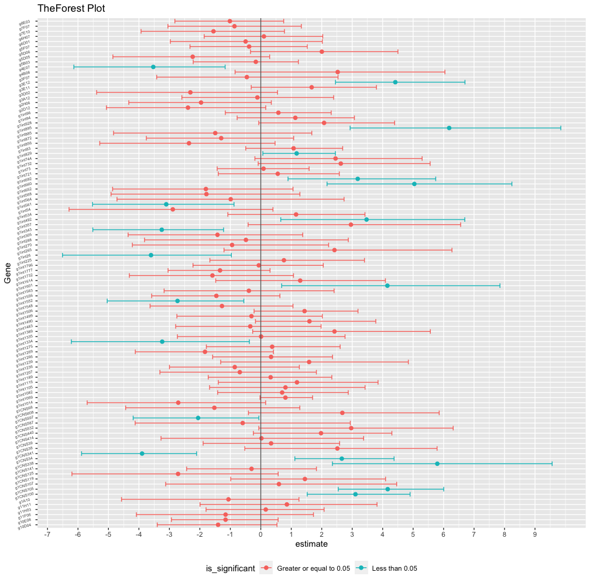

<!-- README.md is generated from README.Rmd. Please edit that file -->

```{r, include = FALSE}
knitr::opts_chunk$set(
  collapse = TRUE,
  comment = "#>"
)
```

# Ansøgning

<!-- badges: start -->
<!-- badges: end -->

The goal of Ansøgning is to show analysis of the **Gravier Data Set**

The Author: Miss Oriade Latifah Simpson - MOLS - 

Date: August 2023 

This data is taken from https://github.com/ramhiser/datamicroarray/wiki/Gravier-%282010%29

---------------------------------------

### Code 

The code and figure can be found  below: 

```{r written, eval=FALSE, include= TRUE}

library(tidyverse)

# Load the gravier data 
# Note: It is a list

# 1. load the file into memory. 
load(file = "data/_raw/gravier.RData")

# 2. Create a tibble from the gravier data. 
ycol <- as_tibble(gravier$y)
xmat <- gravier$x
grav <- bind_cols(ycol, xmat)

# 3. Relocate the y column to the first column and name it outcome.
gravier_not_dirty <- rename(grav, outcome = value)
gravier_not_dirty 

# 4. Recode the outcome so that 0 is good and 1 is poor.
gravier_clean <- gravier_not_dirty %>% 
  mutate(outcome = case_when(outcome == "good" ~ 0,
                             outcome == "poor" ~ 1))

gravier_clean 
View(gravier_clean)

set.seed(101)

# 5. Choose 100 random genes. 
gravier_new_clean <- gravier_clean %>%
  select(1, sample(colnames(.)[-1], 100))

gravier_new_clean

# (Find Info about these)
dim(gravier_new_clean)
glimpse(gravier_new_clean)

# 6. From clean data, transform to long format. 
head(gravier_new_clean)

gravier_long <- gravier_new_clean %>% 
                 pivot_longer(
                cols = ! starts_with("outcome"),
                names_to = "gene", 
                values_to = "log2_expr_level")


gravier_long
head(gravier_long)


# 7. Fit a logistic regression to each gene
# modelling: outcome ~ log2_expr_lvl
gravier_data_nested <- gravier_long %>% 
  group_by(gene) %>% 
  nest()


# Define a formula for logistic regression
formula <- formula(outcome ~ log2_expr_level)


# Mutate to add models to each nested group
gravier_data_n <- gravier_data_nested %>%
  mutate(model = map(data, ~ glm(formula, data = ., 
                                 family = binomial(link = "logit"))),
         # Generate tidy data with beta estimates, 
         # std.errors, statistics and also
         # p-values/add beta-estimates and confidence intervals
         model_summary = map(model, broom::tidy, conf.int = TRUE)
         )


# model summary. 
gravier_data_n$model_summary 

# model 
gravier_data_n$model

# df. 
gravier_data_n

# Take the tidied model out of a tibble and show it.(and filter intercept rows).
gravier_data_birded <- gravier_data_n %>%
  unnest(model_summary) %>% 
  filter(str_detect(term,"log2_expr_level"))

gravier_data_birded

# 8. Add an indicator for whether the p-value was less than or equal to 0.05
gravier_indicator <- gravier_data_birded %>%
  mutate(pval_indicator = case_when(
    p.value < 0.05 ~ "Less than 0.05 (SIG)", TRUE ~ "Greater or equal to 0.05 (NotSig)"
  ))

gravier_indicator

# That is your long - modelled data. 
# Create a forest-plot of the slopes (beta1 estimates) and add 95% CI

forest_data <- gravier_indicator %>%
  group_by(gene) %>% 
  arrange(estimate)

forest_data

# Create the forest plot using ggplot2
forest_plot <- ggplot(data = forest_data, 
                      mapping = aes(x = estimate, y = gene, color = pval_indicator)) +
  geom_point(aes(color = pval_indicator), size = 2) +
  geom_errorbarh(aes(xmin = conf.low, xmax = conf.high))+
  
  # Add a line at the estimate
  geom_vline(xintercept = 0, color = "gray40") +
  
  # set x axis values 
  scale_x_continuous(breaks = seq(-9, 9, by = 1)) +
  labs(title = "The Forest Plot",
       x = "estimate",
       y = "Gene",
       colour = "is_significant") +
  theme(legend.position = "bottom")+
  theme(axis.text.y = element_text(size = 5, hjust = 0.5,vjust = 1,  angle = 15))

#forest_plot

# Add code to the README showing short analysis with nice clear code.
```

.... and also in the file called Ansogning_Code.R

### Visualisation 


```{r pressure, echo = FALSE}


```

If you encounter a clear bug, please file an issue with a minimal
reproducible example on GitHub. For questions and other discussion,
please email `s172084@dtu.dk` or `orie.simpson@gmail.com`

Please note that this project is released with a Contributor Code of
Conduct. By participating in this project you agree to abide by its
terms.
